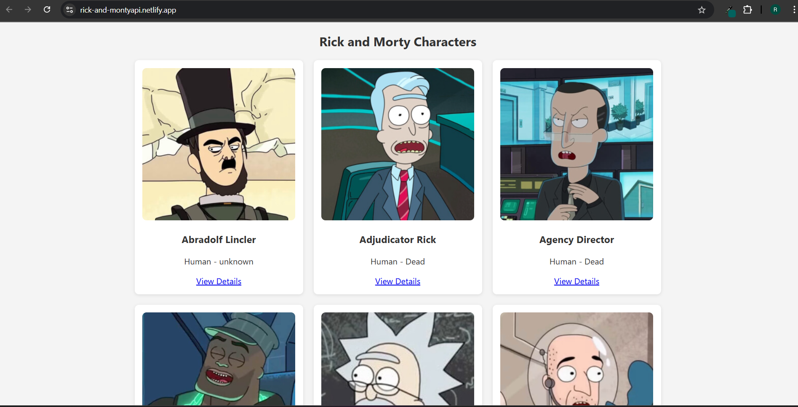
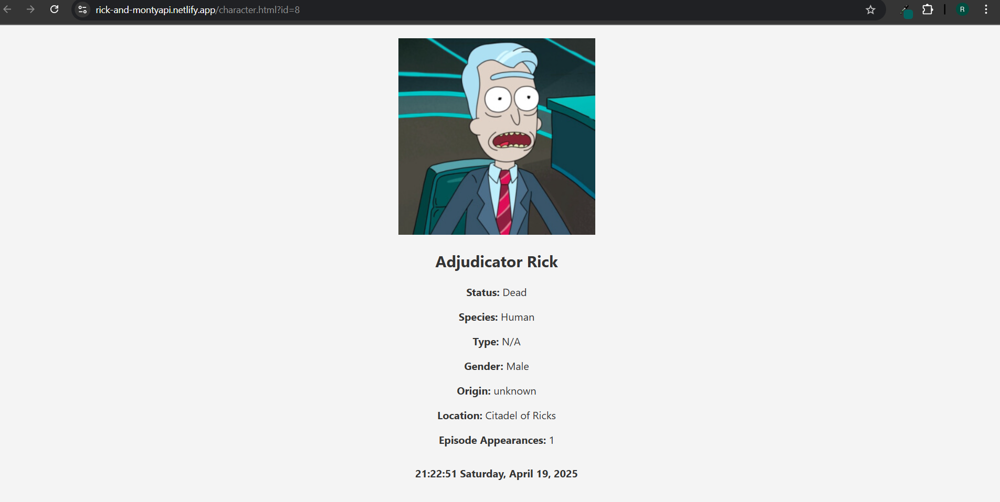

# 🧬 Rick and Morty Wiki Application

A responsive web-based encyclopedia that displays characters from the **Rick and Morty Universe** using the public [Rick and Morty API](https://rickandmortyapi.com/). Users can browse characters, view detailed information, and enjoy a live-updating clock!

## 🚀 Live Demo

👉 **[Rick and Morty Wiki - Live on Netlify](https://rick-and-montyapi.netlify.app/)**  
Explore the characters, pagination, and detail views all in one place!

## 🌟 Features

- Displays characters in a **3x2 grid** (6 per page)
- Pagination with **Next** and **Previous** buttons
- **Detailed character view** in a new tab
- **Live digital clock** in the footer (HH:MM:SS Day Month Date, Year)
- Responsive and user-friendly UI

---

## 🖼️ Screenshots

### 🔍 Character Gallery (Main Page)

---

### 📋 Character Detail Page

